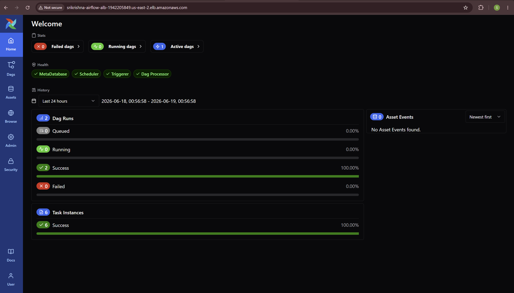
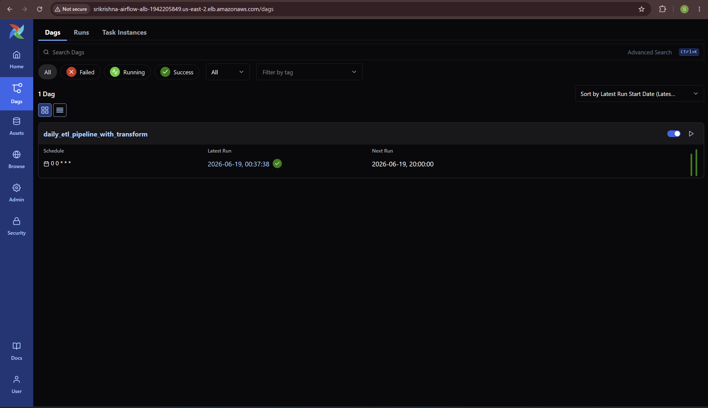
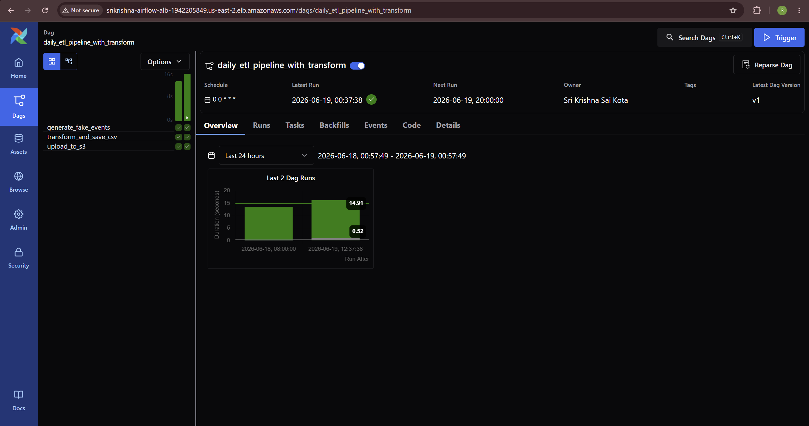
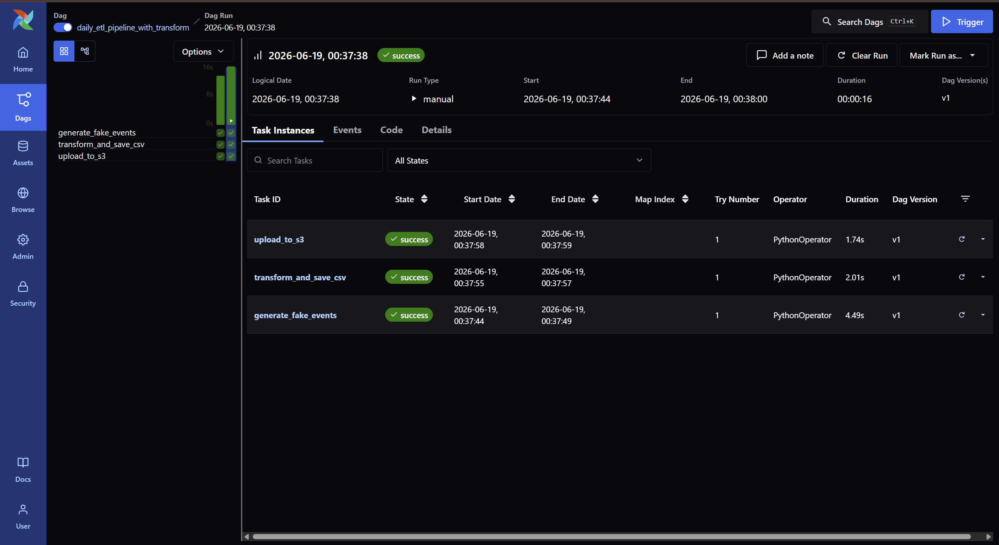
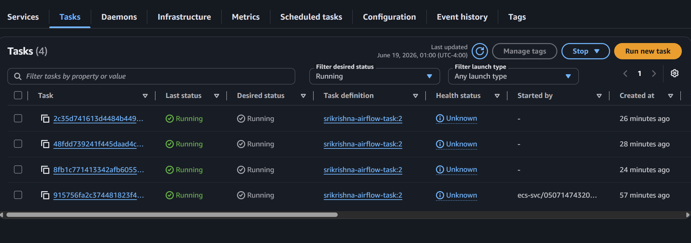
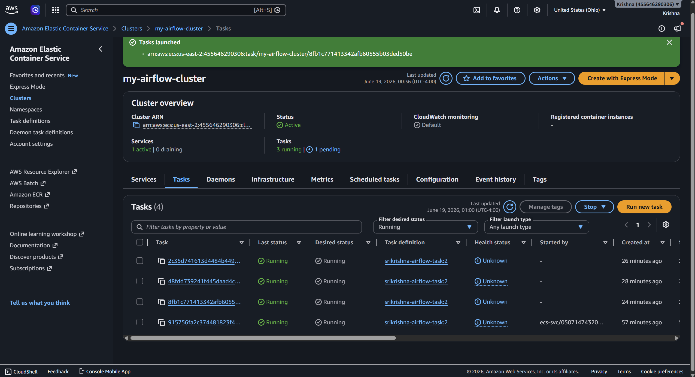
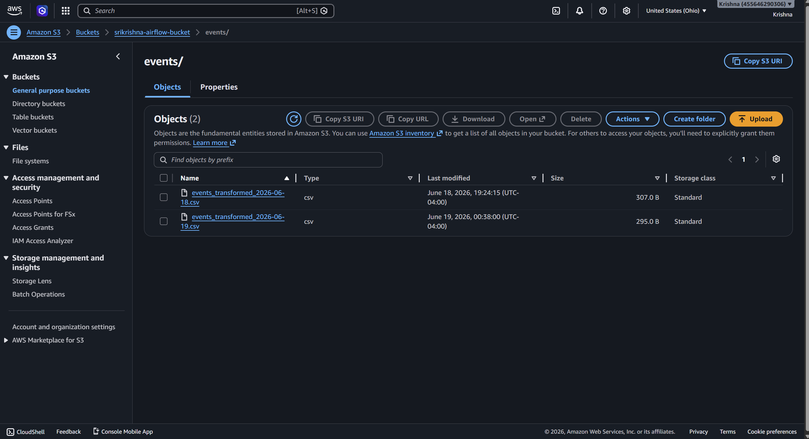
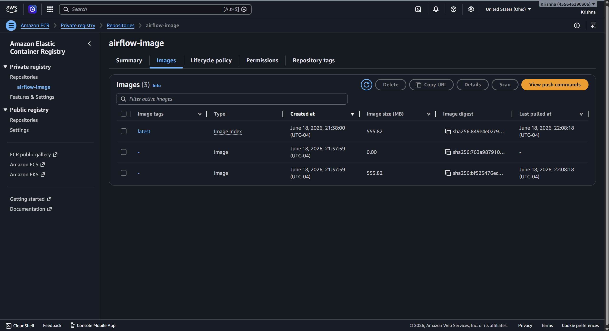
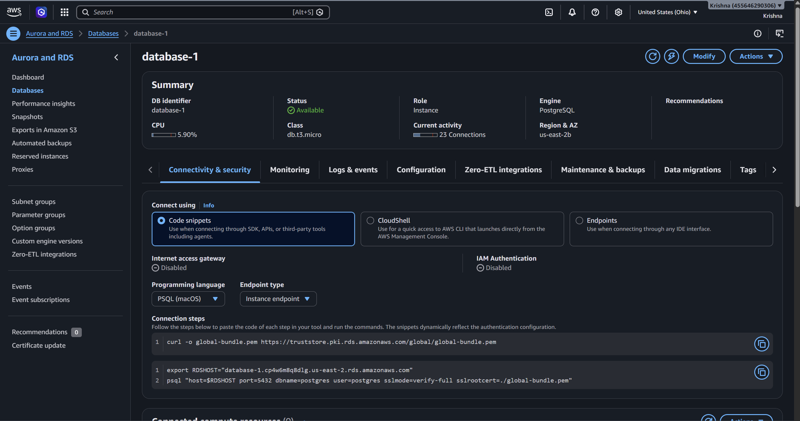
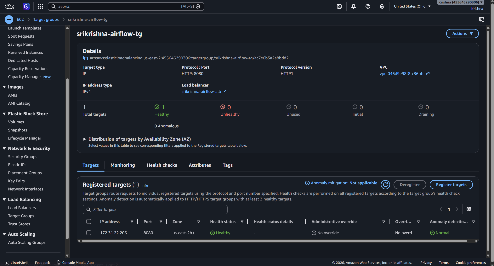

# ✈️ Production Airflow ETL Pipeline — AWS ECS Deployment

A production-grade Apache Airflow ETL pipeline deployed on **AWS ECS Fargate**, with a custom Docker image, RDS PostgreSQL metadata database, S3 data storage, and an Application Load Balancer for public access.

---

## 🏗️ Architecture

```
Local Development
      ↓
Custom Docker Image (Airflow 3.0 + DAGs + Dependencies)
      ↓
Amazon ECR (Container Registry)
      ↓
Amazon ECS Fargate (Serverless Containers)
      ↓
┌─────────────────────────────────────────────┐
│  api-server │ scheduler │ triggerer │ dag-processor │
└─────────────────────────────────────────────┘
      ↓                         ↓
Application                Amazon RDS
Load Balancer              PostgreSQL
(Public UI)                (Metadata)
      ↓
   Amazon S3
 (ETL Output)
```

---

## 📦 ETL Pipeline

**DAG: `daily_etl_pipeline_with_transform`** — a 3-task pipeline scheduled daily.

| Task | Description |
|---|---|
| `generate_fake_events` | Generates mock event data (timestamp, event, intensity, category) |
| `transform_and_save_csv` | Sorts events by intensity score descending and saves as CSV |
| `upload_to_s3` | Uploads the transformed CSV to Amazon S3 |

**Flow:** `generate_fake_events → transform_and_save_csv → upload_to_s3`

---

## ☁️ AWS Infrastructure

| Service | Purpose |
|---|---|
| **Amazon ECS Fargate** | Runs Airflow components as serverless containers |
| **Amazon ECR** | Stores the custom Docker image |
| **Amazon RDS PostgreSQL** | Airflow metadata database (db.t3.micro) |
| **Amazon S3** | Stores the transformed CSV output |
| **Application Load Balancer** | Exposes the Airflow UI publicly |
| **IAM Role** | Grants ECS tasks permission to write to S3 |
| **Security Groups** | Controls network access (ports 80, 5432, 8080) |

---

## 🚀 Deployment Steps

### Prerequisites
- AWS Account with CLI configured
- Docker Desktop installed
- Python 3.8+

### Step 1: Build Custom Docker Image
```bash
docker build --no-cache -t airflow-image:latest .
```

### Step 2: Push to Amazon ECR
```bash
aws ecr get-login-password --region us-east-2 | docker login --username AWS --password-stdin YOUR-ACCOUNT-ID.dkr.ecr.us-east-2.amazonaws.com
docker tag airflow-image:latest YOUR-ACCOUNT-ID.dkr.ecr.us-east-2.amazonaws.com/airflow-image:latest
docker push YOUR-ACCOUNT-ID.dkr.ecr.us-east-2.amazonaws.com/airflow-image:latest
```

### Step 3: Create AWS Infrastructure
```bash
aws s3 mb s3://your-bucket-name --region us-east-2
aws ecs create-cluster --cluster-name my-airflow-cluster --region us-east-2
aws ecr create-repository --repository-name airflow-image --region us-east-2
```

### Step 4: Create ECS Task Definition
- Launch type: AWS Fargate
- CPU: 1 vCPU, Memory: 3GB
- Task role: ecsTaskExecutionRole
- Container port: 8080
- Entry point: `airflow`, Command: `api-server`

### Step 5: Run One-Time Setup Tasks
```
# Migrate the metadata database
Command override: db migrate

# Create an admin user (Airflow 3.0 syntax)
Command override: users,create,--username,airflow,--firstname,Air,--lastname,Flow,--email,admin@example.com,--password,airflow,--role,Admin
```

### Step 6: Run Background Services (each as a separate ECS task)
```
Command: scheduler
Command: triggerer
Command: dag-processor
```

### Step 7: Access the Airflow UI
```
http://YOUR-ALB-DNS
```

---

## 🔑 Key Lessons Learned

### Security Group Configuration — the critical fix
The most important debugging lesson: **port 8080 must be open** in the security group so the ALB can reach the ECS containers. Without it, health checks time out and tasks restart endlessly even though Airflow is running fine inside the container.

```bash
aws ec2 authorize-security-group-ingress \
  --group-id YOUR-SG-ID \
  --protocol tcp \
  --port 8080 \
  --cidr 0.0.0.0/0 \
  --region us-east-2
```

### Health Check Configuration
The ALB health check needs the right path and a generous timeout to allow Airflow time to start:
```bash
aws elbv2 modify-target-group \
  --target-group-arn YOUR-TG-ARN \
  --health-check-path "/" \
  --health-check-interval-seconds 120 \
  --health-check-timeout-seconds 60 \
  --matcher HttpCode=200-499
```

---

## ⚙️ Tech Stack

| Category | Tool |
|---|---|
| Orchestration | Apache Airflow 3.0 |
| Containerization | Docker |
| Container Registry | Amazon ECR |
| Container Runtime | Amazon ECS Fargate |
| Database | Amazon RDS PostgreSQL |
| Storage | Amazon S3 |
| Load Balancer | Application Load Balancer |
| Language | Python 3.12 |
| AWS SDK | boto3 |
| Data Processing | pandas |

---

## 📁 Project Structure

```
airflow-aws-deployment/
├── dags/
│   └── aws_dag.py          # ETL DAG definition
├── docker-compose.yaml     # Local development setup
├── requirements.txt        # Python dependencies
├── screenshots/            # Deployment proof images
└── .gitignore
```

---

## 💰 Cost Optimization

```bash
# Stop the ECS service when not in use
aws ecs update-service --cluster my-airflow-cluster \
  --service my-airflow-service --desired-count 0 --region us-east-2

# Delete the ALB to save the biggest idle cost
aws elbv2 delete-load-balancer --load-balancer-arn YOUR-ALB-ARN --region us-east-2
```

| Resource | Approx. cost when running |
|---|---|
| ECS Fargate (4 tasks) | ~$15/month |
| Application Load Balancer | ~$16/month |
| RDS (free tier) | $0 |
| S3 (free tier) | $0 |
| ECR / Security Groups | Free |

---

## 🖼️ Deployment Proof

### 1. Airflow Home — All Components Healthy
The Airflow UI running in the cloud via the ALB, with MetaDatabase, Scheduler, Triggerer, and Dag Processor all healthy.



### 2. DAG List via Load Balancer
The deployed DAG accessible through the public ALB URL.



### 3. DAG Overview
Pipeline overview showing schedule, latest run, and owner.



### 4. DAG Run — All Tasks Successful
All three tasks (generate → transform → upload) completing successfully in the cloud.



### 5. ECS Tasks Running
All four Airflow components (api-server, scheduler, triggerer, dag-processor) running as Fargate tasks.



### 6. ECS Cluster Overview
The `my-airflow-cluster` with active service and running tasks.



### 7. S3 Output
Transformed CSV files uploaded to the S3 bucket by the pipeline.



### 8. ECR — Pushed Docker Image
The custom Airflow image stored in Amazon ECR with the `latest` tag.



### 9. RDS PostgreSQL — Available
The metadata database backing Airflow, in Available status.



### 10. ALB — Healthy Target
The load balancer target group showing a healthy container on port 8080.



---

## 👤 Author

**Sri Krishna Sai Kota**
MS Computer Science · University of South Florida

- 🔗 LinkedIn: [linkedin.com/in/srikrishnasai](https://linkedin.com/in/srikrishnasai/)
- 💻 GitHub: [github.com/KRISHNA-05-06](https://github.com/KRISHNA-05-06)

---

> 💡 *This project demonstrates production-grade cloud deployment of Apache Airflow using AWS ECS Fargate — the same architecture used by real data engineering teams.*